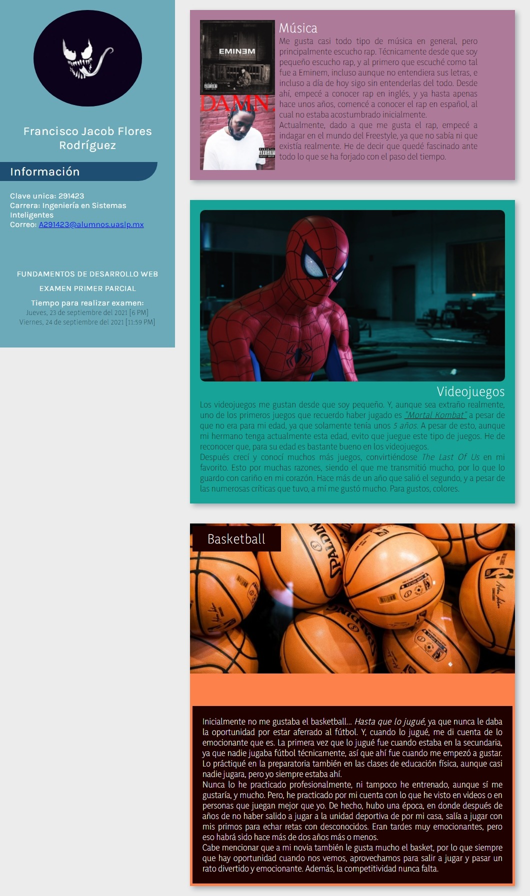
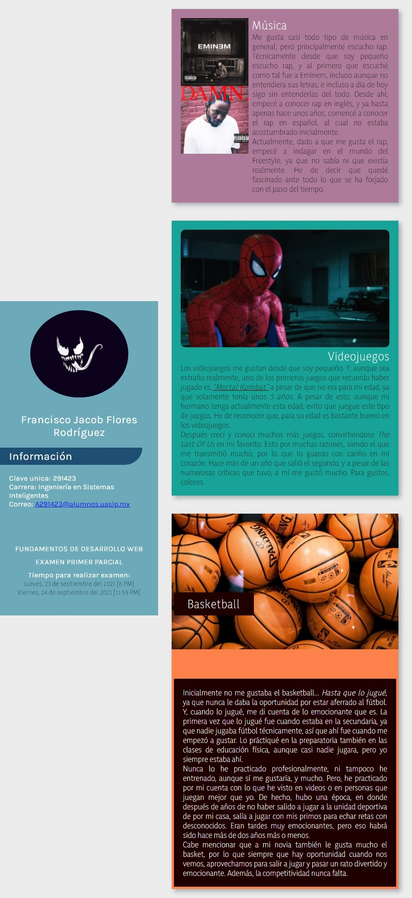
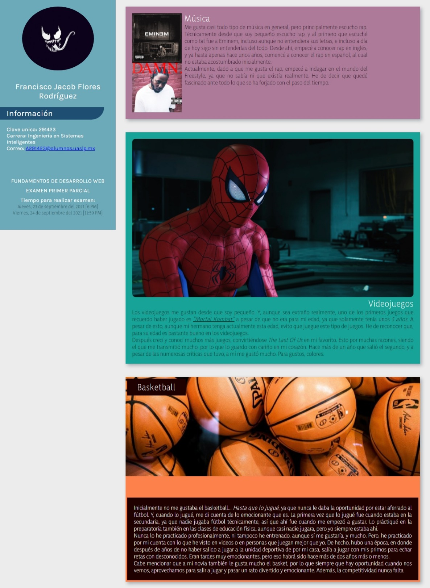
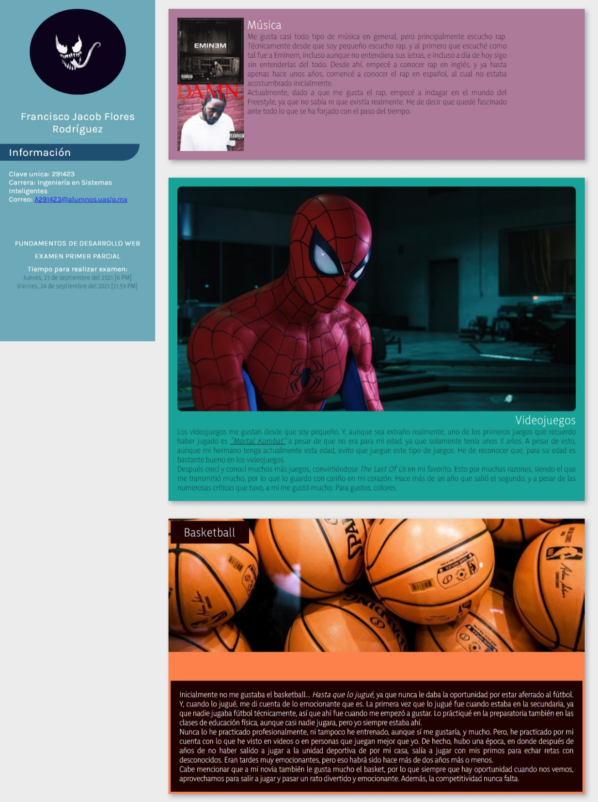
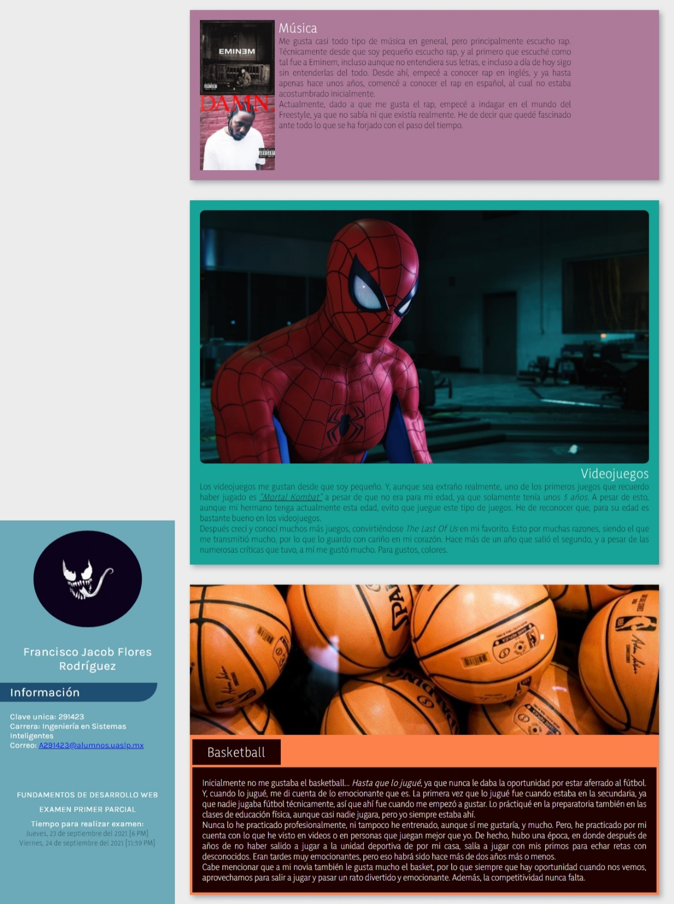

# FDW: EXAMEN PRIMER PARCIAL (1P) - HTML, CSS

> **Fecha para realizar el examen:** Miercoles, 23/SEP [6 PM] - Jueves, 24/SEP
> [11:59 PM]

## INSTRUCCIONES

> [FDW - EXAMEN 1P - INSTRUCCIONES PDF](FDW_1P%20-%20INSTRUCCIONES%20Primer%20Examen%20Parcial%20-%2023-SEP-2021.pdf "FDW - EXAMEN 1P - INSTRUCCIONES PDF")

Realizar una página web que sea como un foro personal. Esta página debe contar
con los siguientes elementos:

1. Una barra lateral que contenga su información básica
2. Usar al menos 2 fuentes externas.
3. Un contenedor más grande en el que van a poner 3 secciones con algo que les
   guste, como un hobbie. Cada una de estas secciones debe tener un diseño
   distinto, pero siempre teniendo los siguientes elementos:
   - Una imagen•Un encabezado
   - Una descripción de la sección (ej. Si la sección es de música, pueden poner
     el tipo y las bandas que más les guste)
4. Para aplicar los estilos se deben usar al menos 1 selector de cada tipo:
   - Etiqueta
   - Id
   - Clase
   - Atributo
   - Pseudoclase y pseudoelemento
   - Combinadores

### Imagen de referencia de cómo debería quedar el sitio

Como ya lo indica el profesor en las instrucciones, no tiene que quedar igual,
pero sí similar respecto a estructura.

## RESULTADOS (Screenshots)

## FUENTES

1. [https://www.freecodecamp.org/news/semantic-html5-elements/](https://www.freecodecamp.org/news/semantic-html5-elements/ "https://www.freecodecamp.org/news/semantic-html5-elements/")
1. [https://www.w3schools.com/html/html5_semantic_elements.asp](https://www.w3schools.com/html/html5_semantic_elements.asp "https://www.w3schools.com/html/html5_semantic_elements.asp")
1. [https://developer.mozilla.org/en-US/docs/Web/HTML/Element/time#usage_notes](https://developer.mozilla.org/en-US/docs/Web/HTML/Element/time#usage_notes "https://developer.mozilla.org/en-US/docs/Web/HTML/Element/time#usage_notes")
1. [coolors.co / Generador de paleta de colores / Paleta de colores que utilicé](https://coolors.co/ececec-ad7a99-253d5b-17a398-fc814a-fc8c5a-1f0200 "coolors.co / Generador de paleta de colores / Paleta de colores que utilicé")
1. [https://stackoverflow.com/a/43001159/13562806](https://stackoverflow.com/a/43001159/13562806 "https://stackoverflow.com/a/43001159/13562806")
1. [https://stackoverflow.com/a/6288104/13562806](https://stackoverflow.com/a/6288104/13562806 "https://stackoverflow.com/a/6288104/13562806")
1. [https://www.arsys.es/blog/desarrolloweb-tbd/](https://www.arsys.es/blog/desarrolloweb-tbd/ "https://www.arsys.es/blog/desarrolloweb-tbd/")
1. [https://developer.mozilla.org/es/docs/Web/CSS/::before](https://developer.mozilla.org/es/docs/Web/CSS/::before "https://developer.mozilla.org/es/docs/Web/CSS/::before")
1. [https://stackoverflow.com/questions/5803023/how-to-place-two-divs-next-to-each-other](https://stackoverflow.com/questions/5803023/how-to-place-two-divs-next-to-each-other "https://stackoverflow.com/questions/5803023/how-to-place-two-divs-next-to-each-other")
1. [https://www.w3docs.com/snippets/css/how-to-vertically-align-text-next-to-an-image.html](https://www.w3docs.com/snippets/css/how-to-vertically-align-text-next-to-an-image.html "https://www.w3docs.com/snippets/css/how-to-vertically-align-text-next-to-an-image.html")
1. [https://www.w3schools.com/tags/tag_figcaption.asp](https://www.w3schools.com/tags/tag_figcaption.asp "https://www.w3schools.com/tags/tag_figcaption.asp")
1. [https://stackoverflow.com/questions/55518487/how-to-make-space-between-elements-inside-div-container/55520861](https://stackoverflow.com/questions/55518487/how-to-make-space-between-elements-inside-div-container/55520861 "https://stackoverflow.com/questions/55518487/how-to-make-space-between-elements-inside-div-container/55520861")
1. [calc() - Calcular medida en CSS - **Útil para no hacer cálculos manuales**](https://stackoverflow.com/a/33444984/13562806 "https://stackoverflow.com/a/33444984/13562806")
1. [https://stackoverflow.com/questions/90178/make-a-div-fill-the-height-of-the-remaining-screen-space](https://stackoverflow.com/questions/90178/make-a-div-fill-the-height-of-the-remaining-screen-space "https://stackoverflow.com/questions/90178/make-a-div-fill-the-height-of-the-remaining-screen-space")
1. [https://stackoverflow.com/questions/526035/how-can-i-position-my-div-at-the-bottom-of-its-container](https://stackoverflow.com/questions/526035/how-can-i-position-my-div-at-the-bottom-of-its-container "https://stackoverflow.com/questions/526035/how-can-i-position-my-div-at-the-bottom-of-its-container")
1. [https://fonts.google.com/specimen/Karla](https://fonts.google.com/specimen/Karla "https://fonts.google.com/specimen/Karla")
1. [https://www.w3.org/Style/Examples/007/center.en.html#block](https://www.w3.org/Style/Examples/007/center.en.html#block "https://www.w3.org/Style/Examples/007/center.en.html#block")
1. [https://stackoverflow.com/questions/26421274/css-circular-cropping-of-rectangle-image](https://stackoverflow.com/questions/26421274/css-circular-cropping-of-rectangle-image "https://stackoverflow.com/questions/26421274/css-circular-cropping-of-rectangle-image")
1. [https://developer.mozilla.org/en-US/docs/Web/HTML/Element/aside](https://developer.mozilla.org/en-US/docs/Web/HTML/Element/aside "https://developer.mozilla.org/en-US/docs/Web/HTML/Element/aside")
1. [https://developer.mozilla.org/en-US/docs/Web/HTML/Element](https://developer.mozilla.org/en-US/docs/Web/HTML/Element "https://developer.mozilla.org/en-US/docs/Web/HTML/Element")
1. [freeCodeCamp / HTML Semántico](https://www.freecodecamp.org/news/semantic-html5-elements/ "freeCodeCamp / HTML Semántico")
1. [W3Schools / HTML Semántico](https://www.w3schools.com/html/html5_semantic_elements.asp "W3Schools / HTML Semántico")
